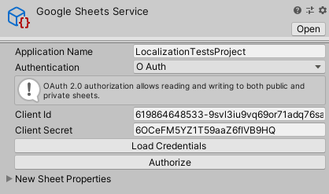
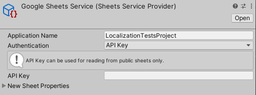
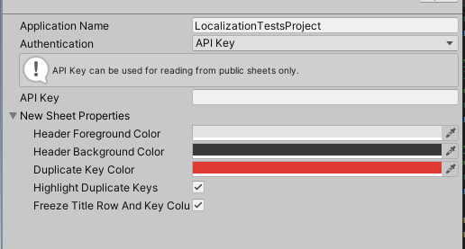

# Sheets Service Provider 

To connect your project to the Google Sheets service, you need to use a Sheets Service Provider asset. This asset includes properties for authentication and for creating a new sheet from inside the Editor.. 

There are two possible ways to authorize: OAuth or API Key. Use OAuth if you want to read from or write to private sheets, or API Key if you only need to read from public sheets.  

A Sheets Service Provider always contains the following properties:

| **Property**                    | **Description** |
| ------------------------------- | --------------- |
| **Application Name**            | The name of the application that will be sent when connecting to Google.
| **Authentication**              | The [authorization](https://developers.google.com/sheets/api/guides/authorizing) methodology to use: [API Key](https://developers.google.com/sheets/api/guides/authorizing#APIKey) or [OAuth 2.0](https://developers.google.com/identity/protocols/oauth2).  This property defines which other properties are available on the Sheets Service provider asset; see O Auth authentication and API Key authentication, below, for details.
| **New Sheet Properties**       | Properties to use when creating a new Google Spreadsheet sheet. **See New Sheet Properties**, below.

This section describes the Sheet Service Provider asset for both authentication types; for details on setting them up; see [Configuring authentication](Google-Sheets-Configuring-Authentication.md). Configuring authentication, below. 

## OAuth Authentication

| **Property**                    | **Description** |
| ------------------------------- | --------------- |
| **Client Id**                   | Enter your OAuth 2.0 client ID.
| **Client Secret**               | Enter your OAuth 2.0 client secret.
| **Load Credentials**            | Load the *credentials.json* file that will be provided by Google when generating OAuth 2.0 credentials.
| **Authorize**                   | Connect to Google using the OAuth 2.0 credentials to perform the initial login and token generation so that no further manual authentication will be required for the duration of the token.

## API Key authentication

| **Property**                    | **Description** |
| ------------------------------- | --------------- |
| **API Key**                     | Enter the generated API key. see [Configuring authentication](Google-Sheets-Configuring-Authentication.md).

## New Sheet Properties

The Sheets Service Provider provides a set of properties to create a new sheet.

| **Property**                        | **Description** |
| ----------------------------------- | --------------- |
| **Header Foreground Color**         | Set the text color of the first row in the sheet.
| **Header Background Color**         | Set the background color of the first row in the sheet.
| **Duplicate Key Color**             | Set the background color of cells which contain duplicate keys. This highlighting only occurs if Highlight Duplicate Keys is enabled.
| **Highlight Duplicate Keys**        | Enable this property to highlight spreadsheet cells that contain duplicate keys. Use **Duplicate Key Color** to define the color of this highlight.
| **Freeze Title Row And Key Column** | Enable this to freeze the first column and first row in the new spreadsheet, so that they are always visible when you navigate the sheet. 
